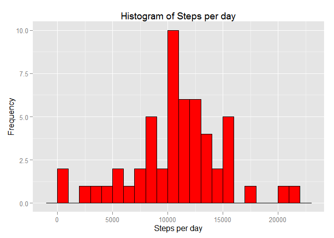
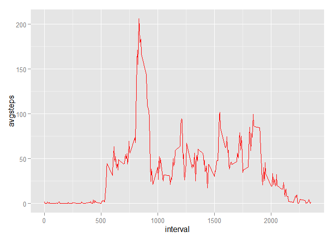
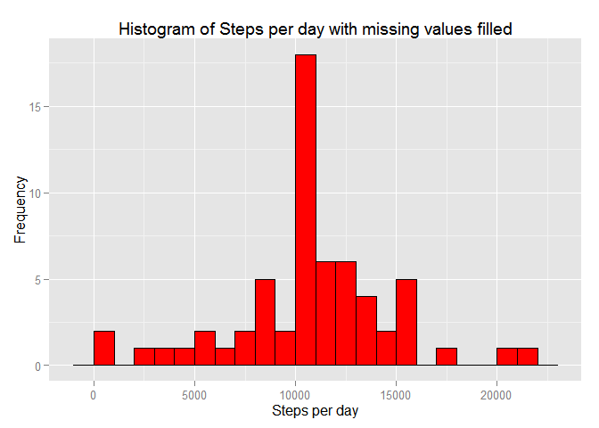
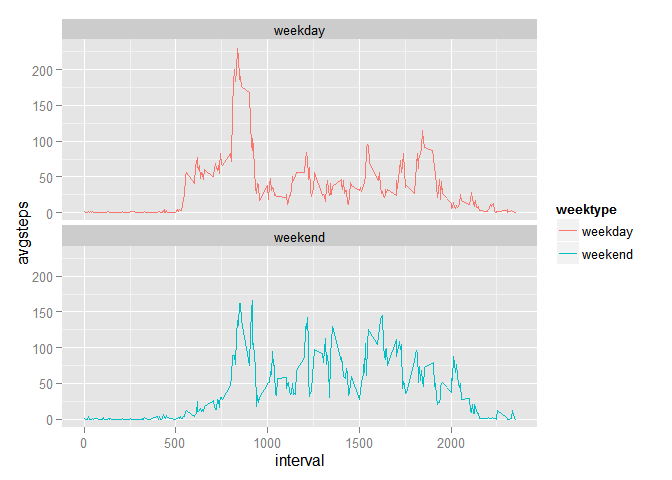

# Reproducible Research: Peer Assessment 1
## Loading necessary Packages

```r
library(dplyr)
```

```
## 
## Attaching package: 'dplyr'
```

```
## The following objects are masked from 'package:stats':
## 
##     filter, lag
```

```
## The following objects are masked from 'package:base':
## 
##     intersect, setdiff, setequal, union
```

```r
library(ggplot2)
library(lubridate)
```

## Loading and preprocessing the data
**Note**: It is assumed that the dataset *activity.csv* has been saved in your working directory.

```r
actvdata<-read.csv("activity.csv", header = TRUE, colClasses = c("numeric", "character", "integer"), na.strings="NA")
head(actvdata)  ## check the data
```

```
##   steps       date interval
## 1    NA 2012-10-01        0
## 2    NA 2012-10-01        5
## 3    NA 2012-10-01       10
## 4    NA 2012-10-01       15
## 5    NA 2012-10-01       20
## 6    NA 2012-10-01       25
```

```r
actvdata$date<-ymd(actvdata$date) ## change the date into dateformat
str(actvdata)
```

```
## 'data.frame':	17568 obs. of  3 variables:
##  $ steps   : num  NA NA NA NA NA NA NA NA NA NA ...
##  $ date    : POSIXct, format: "2012-10-01" "2012-10-01" ...
##  $ interval: int  0 5 10 15 20 25 30 35 40 45 ...
```

## What is mean total number of steps taken per day?
#### For this part of the assignment the missing values can be ignored.
1. Calculate the total number of steps taken per day

```r
dailysteps <- actvdata %>%
  filter(!is.na(steps)) %>%
  group_by(date) %>%
  summarize(dailysteps = sum(steps)) %>%
  print
```

```
## Source: local data frame [53 x 2]
## 
##          date dailysteps
##        (time)      (dbl)
## 1  2012-10-02        126
## 2  2012-10-03      11352
## 3  2012-10-04      12116
## 4  2012-10-05      13294
## 5  2012-10-06      15420
## 6  2012-10-07      11015
## 7  2012-10-09      12811
## 8  2012-10-10       9900
## 9  2012-10-11      10304
## 10 2012-10-12      17382
## ..        ...        ...
```

2. Make a histogram of the total number of steps taken each day

```r
ggplot(dailysteps, aes(x = dailysteps)) +
  geom_histogram(col="black", fill = "red", binwidth = 1000) +
  labs(title = "Histogram of Steps per day", x = "Steps per day", y = "Frequency")
```



3. Calculate and report the mean and median of the total number of steps taken per day

```r
mean_steps<-mean(dailysteps$dailysteps)
median_steps<-median(dailysteps$dailysteps)
```


```r
mean_steps
```

```
## [1] 10766.19
```


```r
median_steps
```

```
## [1] 10765
```

## What is the average daily activity pattern?
#### First calculate the average number of steps in 5-min interval across all day

```r
avgsteps_by_interval <- actvdata %>%
  filter(!is.na(steps)) %>%
  group_by(interval) %>%
  summarize(avgsteps = mean(steps))
```

1. Make a time series plot (i.e. type = "l") of the 5-minute interval (x-axis) and the average number of steps taken, averaged across all days (y-axis)


```r
ggplot(avgsteps_by_interval, aes(x=interval, y=avgsteps)) +
  geom_line(color = "red")
```



2. Which 5-minute interval, on average across all the days in the dataset, contains the maximum number of steps?

```r
avgsteps_by_interval[which.max(avgsteps_by_interval$avgsteps),]
```

```
## Source: local data frame [1 x 2]
## 
##   interval avgsteps
##      (int)    (dbl)
## 1      835 206.1698
```

## Imputing missing values
1. Calculate and report the total number of missing values in the dataset (i.e. the total number of rows with NAs)

```r
sum(is.na(actvdata$steps))
```

```
## [1] 2304
```
Total missing values is 2304.

2. Filling in all of the missing values for *steps* in the dataset with the average number of steps in the same 5-min interval.
3. Create a new dataset that is equal to the original dataset but with the missing data filled in.


```r
data_fill<-actvdata
na_steps<-is.na(data_fill$steps)
avg_interval_step<-tapply(data_fill$steps, data_fill$interval, mean, na.rm=TRUE, simplify = TRUE)
data_fill$steps[na_steps]<-avg_interval_step[as.character(data_fill$interval[na_steps])]
head(data_fill)
```

```
##       steps       date interval
## 1 1.7169811 2012-10-01        0
## 2 0.3396226 2012-10-01        5
## 3 0.1320755 2012-10-01       10
## 4 0.1509434 2012-10-01       15
## 5 0.0754717 2012-10-01       20
## 6 2.0943396 2012-10-01       25
```

Check if any missing value for refilled dataset

```r
sum(is.na(data_fill$steps))
```

```
## [1] 0
```
Since 0, no missing values for *steps*.

4. Make a histogram of the total number of steps taken each day and Calculate and report the mean and median total number of steps taken per day.
- Calculate the total number of steps per day

```r
dailysteps_fill <- data_fill %>%
  group_by(date) %>%
  summarize(dailysteps = sum(steps)) %>%
  print
```

```
## Source: local data frame [61 x 2]
## 
##          date dailysteps
##        (time)      (dbl)
## 1  2012-10-01   10766.19
## 2  2012-10-02     126.00
## 3  2012-10-03   11352.00
## 4  2012-10-04   12116.00
## 5  2012-10-05   13294.00
## 6  2012-10-06   15420.00
## 7  2012-10-07   11015.00
## 8  2012-10-08   10766.19
## 9  2012-10-09   12811.00
## 10 2012-10-10    9900.00
## ..        ...        ...
```

- Histogram of the total steps per day

```r
ggplot(dailysteps_fill, aes(x = dailysteps)) +
  geom_histogram(col="black", fill = "red", binwidth = 1000) +
  labs(title = "Histogram of Steps per day with missing values filled", x = "Steps per day", y = "Frequency")
```



- Calculate and report the mean and median total number of steps taken per day.

```r
mean(dailysteps_fill$dailysteps)
```

```
## [1] 10766.19
```

```r
median(dailysteps_fill$dailysteps)
```

```
## [1] 10766.19
```

**Note**: comparing to the first part result, means are same but with imputed missing values, median is same as mean.

## Are there differences in activity patterns between weekdays and weekends?
1. Create a new factor variable in the dataset with two levels - "weekday" and "weekend" indicating whether a given date is a weekday or weekend day.

```r
data_fill <- mutate(data_fill, weektype = ifelse(weekdays(data_fill$date)=="Saturday"| weekdays(data_fill$date)=="Sunday", "weekend", "weekday"))
data_fill$weektype <- as.factor(data_fill$weektype)
head(data_fill)
```

```
##       steps       date interval weektype
## 1 1.7169811 2012-10-01        0  weekday
## 2 0.3396226 2012-10-01        5  weekday
## 3 0.1320755 2012-10-01       10  weekday
## 4 0.1509434 2012-10-01       15  weekday
## 5 0.0754717 2012-10-01       20  weekday
## 6 2.0943396 2012-10-01       25  weekday
```
2. Make a panel plot containing a time series plot (i.e. type = "l") of the 5-minute interval (x-axis) and the average number of steps taken, averaged across all weekday days or weekend days (y-axis). 

```r
avgsteps_by_intwk <- data_fill %>%
  group_by(interval, weektype) %>%
  summarize(avgsteps = mean(steps))
s <- ggplot(avgsteps_by_intwk, aes(x=interval, y=avgsteps, color = weektype)) +
  geom_line() +
  facet_wrap(~weektype, ncol = 1, nrow=2)
print(s)
```



From the plot above, on weekday the subject was more active in earlier day, but during weekend, more active in the middle of the day. 
